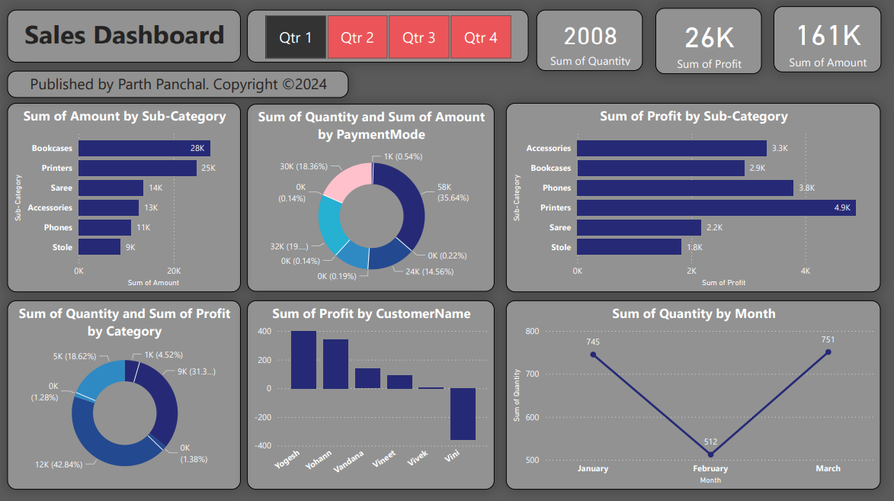

# Sales Dashboard

This repository contains a Power BI report named "Sales Dashboard," which provides insights into sales performance across different dimensions such as quantity, profit, category, sub-category, and payment mode. The report is designed to help analyze and visualize sales data effectively.

## Report Overview

### Visualizations Included

1. **Sum of Quantity by Month**:
   - A line chart displaying the total quantity sold for each month (January, February, March).
   - Helps to identify trends in sales quantity over time.

2. **Sum of Profit by Sub-Category**:
   - A bar chart showing the total profit generated by each sub-category (Accessories, Bookcases, Phones, Printers, Saree, Stole).
   - Useful for understanding which sub-categories contribute the most to profit.

3. **Sum of Quantity and Sum of Profit by Category**:
   - A pie chart that illustrates the proportion of quantity and profit for each category.
   - Offers a quick overview of category performance.

4. **Sum of Quantity and Sum of Amount by Payment Mode**:
   - A pie chart displaying the total quantity and amount for each payment mode.
   - Highlights the distribution of sales across different payment methods.

5. **Sum of Amount by Sub-Category**:
   - A bar chart showing the total amount generated by each sub-category.
   - Provides insights into revenue generation by sub-category.

6. **Sum of Profit by Customer Name**:
   - A bar chart illustrating the total profit for each customer.
   - Helps to identify key customers contributing to profitability.

## Data Source

The data used in this report is derived from sales transactions, including details such as quantity sold, profit, category, sub-category, payment mode, and customer name.

## File Details

- [`Sales-Dashboard-shop.pdf`](Sales-Dashboard-shop.pdf): The Power BI report exported as a PDF file. This file contains all the visualizations and insights mentioned above.
